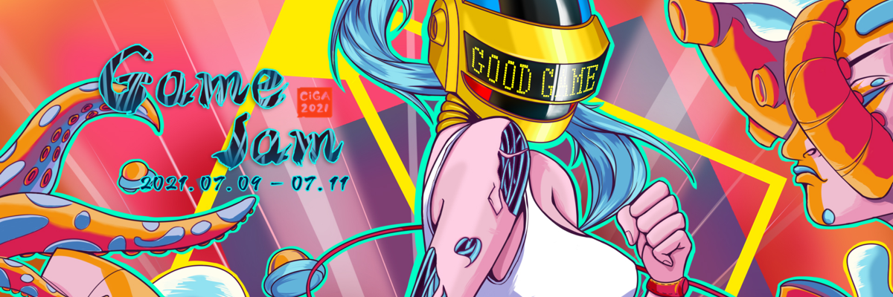
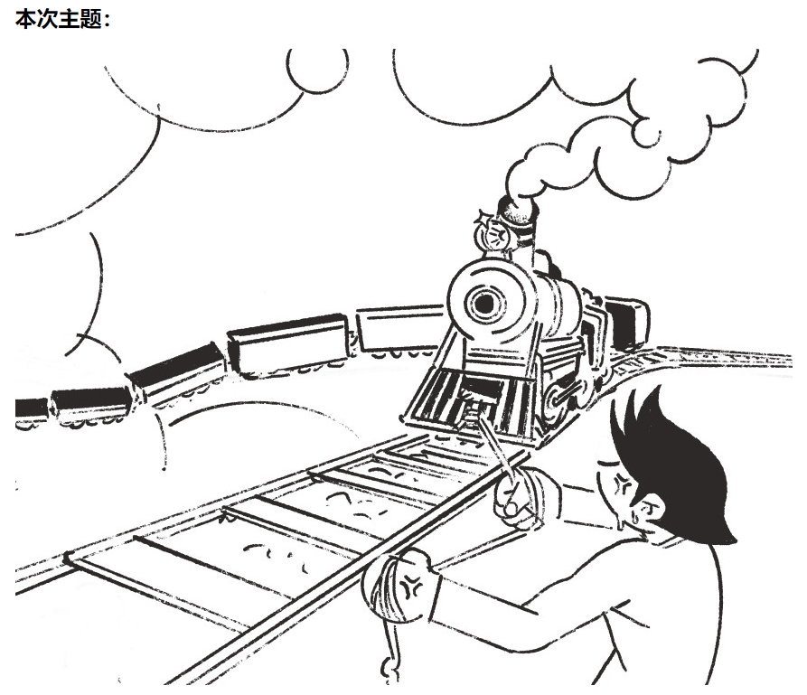
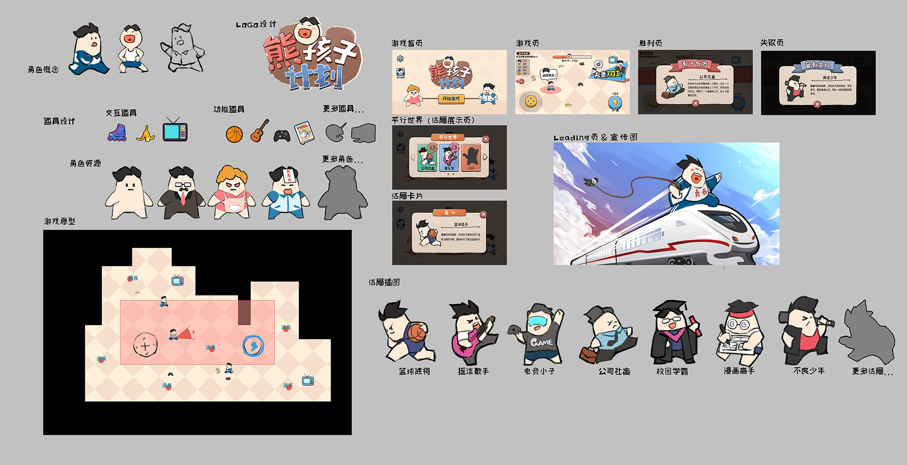

# 2021 CiGA Game Jam 厦门站

- 时间: 2021-07-09 ~ 2021-07-11 48小时极限游戏开发.

#### 关于Game Jam:

Game Jam是一种限定时间与条件的游戏极限开发活动，专注于游戏领域的创意开发，鼓励热爱游戏和有开发热情的人群聚集在一起，通过游戏创作这一形式和过程进行头脑风暴、经验分享以及自我表达。通过一个限定的时间唤醒游戏的创意理念并同时体验游戏的开发过程，包括编程、互动设计、叙事探索、美术设计等都将在限定时间内完成。

#### 主题

## 熊孩子计划.

- [GameJam游戏便当-熊孩子计划.](https://www.youxibd.com/v2/gamejam/cgj2021/works/1189)
- [视频预览-熊孩子计划.](./资料/预览视频.mp4)
- [游戏试玩-熊孩子计划.](https://zy-developer.github.io/GameJam2D/)

| 位置 | 姓名 |
| :--: | :--: |
| 策划 | 林灵 |
| 原画 | 汤声丰 |
| 动作 | 李丽珠 |
| UI | 刘巧清 |
| 程序 | 曾煜、黄宇斌 |

### 作品介绍

本游戏是H5系统下运营的一款休闲类游戏。
生活中，家长们规划着孩子的行为轨迹，同时孩子们也在抵抗着家长们安排好的道路，就像一辆不服从命运安排逃出铁轨的小火车。而家长的目的，便是让孩子们的生活的步入正轨。

玩家将扮演家庭中父母亲的角色，与正处在叛逆期的孩子展开拉锯战。千万注意不要让孩子脱离您的教诲，同时也不能过于束缚孩子贪玩的天性。通过控制场景内的道具构成与数量，循序渐进，培养出让您骄傲的孩子。
